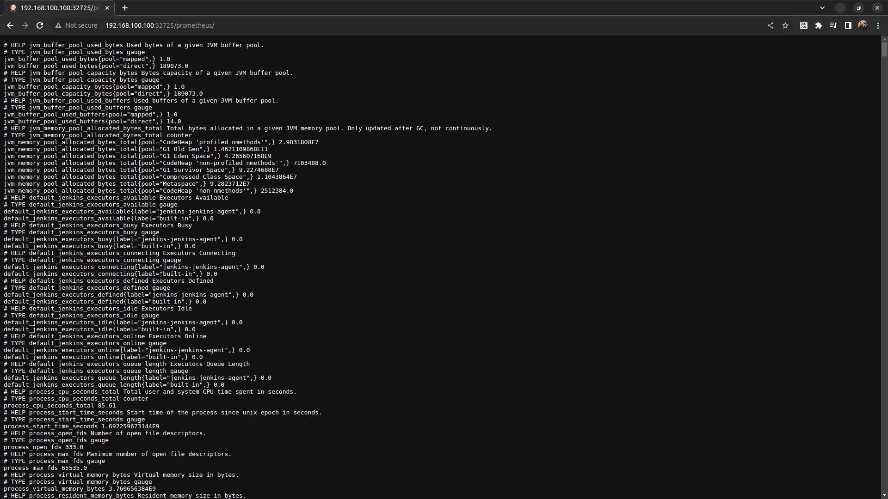
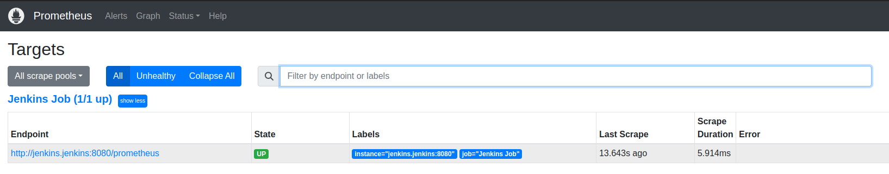
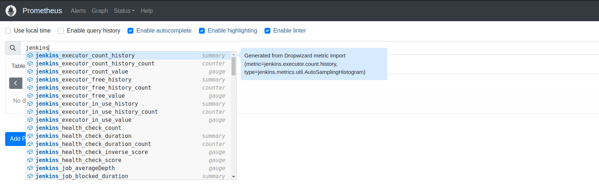
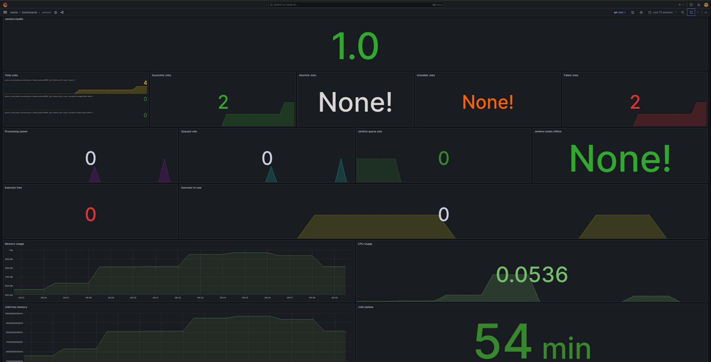

# Jenkins를 활용한 Kubernetes 이미지 배포 및 모니터링

목차

1. [특징](#특징)
2. [Kubernetes plugin for Jenkins](#kubernetes-plugin-for-jenkins)
3. [Kubernetes CLI](#kubernetes-cli)
4. [Prometheus를 사용한 Jenkins 모니터링](#prometheus를-사용한-jenkins-모니터링)

이번 프로젝트는 [YouTube를 벤치마킹한 프로젝트](https://github.com/ddung1203/youtube-reloaded)를 Jenkins를 활용해 Container Image 빌드 및 배포 후 Kuberentes에 Deploy하는 절차를 기술하겠다.

Jenkins는 Master 단독으로 CI/CD 환경을 구축할 수 있으나, 빌드하는 프로젝트가 많은 경우 Master/Slave 구조로 운영한다.

Kubernetes 환경 내 Jenkins를 운용을 목적으로 하기에, Helm을 통해 Jenkins를 설치한다.

참고: [Helm을 이용한 Kubernetes 내 Jenkins 설치](https://github.com/ddung1203/DevOps/blob/main/DevOps/Jenkins.md#jenkins-helm-charts), [Jenkins Values](https://github.com/ddung1203/DevOps/blob/main/DevOps/jenkins/jenkins-values.yaml)

참고: [Kubernetes plugin for Jenkins](https://plugins.jenkins.io/kubernetes/)

참고: [Kubernetes CLI](https://plugins.jenkins.io/kubernetes-cli/)

[사용된 Jenkinsfile](./Jenkinsfile)

## 특징

현재 Kubernetes 환경은 Docker 없이 containerd만 설치되어 있어 docker build 대신 Kaniko를 사용하였다. Kaniko에서 사용할 Credential을 위해 Secret을 먼저 생성해야 하며, 자세한 Kaniko는 [이곳](https://github.com/ddung1203/DevOps/blob/main/DevOps/kaniko.md)을 참고한다.

### Kubernetes plugin for Jenkins

Kubernetes plugin은 Kubernetes에서 실행되는 Jenkins 에이전트의 확장을 자동화한다. 즉, 필요할 때만 동적으로 Kubernetes Pod를 생성하고 각 빌드 후에 삭제가 된다. 이로 인해 별도의 clean up 작업이 필요 없다. Helm으로 Jenkins를 설치하였기 때문에, Jenkins의 `Kubernetes` 플러그인을 따로 설정할 필요 없이 연동이 되어 있다.

가장 기본적인 podTemplate은 하기와 같으며, 동적으로 생성된 Pod에서 아래 stage 작업이 실핸된다. 또한 하기의 경우 Container Template을 지정하지 않아 기본값인 jnlp container로 실행된다.

```js
podTemplate {
  node(POD_LABEL) {
    stage('Run shell') {
      sh 'echo hello world'
    }
  }
}
```

하기와 같이 containerTemplate 구문을 통해 별도의 컨테이너 이미지를 설정해주면, 해당 이미지를 베이스로 동적 Pod가 생성된다.

```js
containerTemplate(name: 'busybox', image: 'busybox', command: 'sleep', args: '99d',
                  livenessProbe: containerLivenessProbe (
                    execArgs: 'some --command',
                    initialDelaySeconds: 30,
                    timeoutSeconds: 1,
                    failureThreshold: 3,
                    periodSeconds: 10,
                    successThreshold: 1
                  )
)
```

이번 프로젝트에선, `yaml` 구문을 사용하여 Pod를 생성토록 하였다.

```yaml
apiVersion: v1
kind: Pod
metadata:
  labels:
    jenkins-build: app-build
    some-label: "build-app-${BUILD_NUMBER}"
spec:
  containers:
    - name: kaniko
      image: gcr.io/kaniko-project/executor:debug
      imagePullPolicy: Always
      command:
        - /busybox/cat
      tty: true
      volumeMounts:
        - name: jenkins-docker-cfg
          mountPath: /kaniko/.docker
  volumes:
    - name: jenkins-docker-cfg
      projected:
        sources:
          - secret:
              name: regsecret
              items:
                - key: .dockerconfigjson
                  path: config.json
```

이후, GitHub 내 Code를 가져온 후, Kaniko를 통해 Image 빌드 및 푸시를 진행한다. 하기와 같다.

```js
stages {
  stage('Checkout') {
    steps {
      script {
        git branch: 'dev', url: 'https://github.com/ddung1203/youtube-jenkins.git', credentialsId: ''
        sh 'ls -al'
      }
    }
  }
  stage('build') {
    steps {
      container('kaniko') {
      sh '/kaniko/executor --context `pwd` \
         --destination ghcr.io/ddung1203/youtube-reloaded:${BUILD_NUMBER} \
         --insecure \
         --skip-tls-verify  \
         --cleanup \
         --dockerfile Dockerfile \
         --verbosity debug'
      }
    }
  }
}
```

> 참고
>
> `Dockerfile`의 경우, YouTube Repository에서 Clone하여 Code를 가져온 후, Docker Image를 빌드 및 생성한다.
>
> ```Dockerfile
> FROM bitnami/git:2.41.0 as git
>
> WORKDIR /app
>
> RUN git clone https://github.com/ddung1203/youtube-reloaded.git .
> RUN rm -rf README.md
>
> FROM node:18.16-buster-slim
>
> WORKDIR /app
>
> COPY --from=git /app .
> RUN npm install
> RUN npm run build
>
> EXPOSE 4000
> CMD ["npm", "start"]
> ```

## Kubernetes CLI

`Kubernetes CLI`의 경우 Job 내에서 Kubernetes 클러스터와 상호작용하도록 `kubectl`을 구성할 수 있다. ArgoCD와 같은 GitOps 도구를 충분히 사용할 수 있지만, Jenkins에서 배포까지 진행하는 과정을 테스트하기 위함이다.

우선, `Kubernetes CLI`를 사용하기 위해, Credential 내 Kube Config를 등록하여야 한다.

> `Manage Credentials` - `New credentials` - `Secret file`

또한 Jenkinsfile 내 하기 code를 추가한다.

```js
...
    containers:
    - name: kubectl
      image: gcr.io/cloud-builders/kubectl
      command:
        - cat
      tty: true

...

stage('deploy') {
  steps {
    script {
      withKubeConfig([credentialsId: 'KUBECONFIG', serverUrl: 'https://kubernetes.default', namespace: 'youtube']) {
        container('kubectl') {
          sh "sed -i 's/youtube-reloaded:latest/youtube-reloaded:${BUILD_NUMBER}/g' k8s-manifest/youtube/youtube-deployment.yaml"
          sh 'kubectl apply -f k8s-manifest/youtube/youtube-deployment.yaml'
        }
      }
    }
  }
}
```

빌드를 수행하면, 하기와 같이 성공적으로 배포됨을 확인할 수 있다.

```bash
 jeonj@ubuntu > ~ > kubectl get all -n youtube
NAME                                      READY   STATUS             RESTARTS        AGE
pod/youtube-deployment-64c9b956dd-2t5sd   1/1     Running            0               17h
pod/youtube-deployment-64c9b956dd-b9qtm   1/1     Running            0               17h
pod/youtube-deployment-64c9b956dd-bqq48   1/1     Running            0               17h

NAME                      TYPE           CLUSTER-IP     EXTERNAL-IP       PORT(S)        AGE
service/youtube-service   LoadBalancer   10.233.61.96   192.168.100.240   80:31307/TCP   20h

NAME                                 READY   UP-TO-DATE   AVAILABLE   AGE
deployment.apps/youtube-deployment   3/3     1            3           20h

NAME                                            DESIRED   CURRENT   READY   AGE
replicaset.apps/youtube-deployment-59855c8ddd   0         0         0       18h
replicaset.apps/youtube-deployment-64c9b956dd   3         3         3       17h
replicaset.apps/youtube-deployment-7cf9b597cd   0         0         0       17h
replicaset.apps/youtube-deployment-7dfd987cf4   0         0         0       18h
replicaset.apps/youtube-deployment-84b945b4db   0         0         0       20h

NAME                                              REFERENCE                       TARGETS   MINPODS   MAXPODS   REPLICAS   AGE
horizontalpodautoscaler.autoscaling/youtube-hpa   Deployment/youtube-deployment   12%/50%    3         5         3          20h
```

## Prometheus를 사용한 Jenkins 모니터링

Jenkins로 CI/CD를 구축한 경우에 빌드 상태나 Jenkins 메모리 사용률, Plugin 상태 등을 조회하고자 하는 경우가 발생한다.

이러한 문제가 있는 경우 알람은 필수이다.

- Jenkins Agent가 Offline인 경우 알람
- Queue에 대기 중인 Job이 많은 경우 알람
- 기타 등등..

이러한 경우 Prometheus의 데이터를 이용하여 AlertManager와의 연동 또는 Grafana의 Alarm 기능과 연동할 수 있다.

참고: [Prometheus-stack 설치](https://github.com/ddung1203/DevOps/blob/main/DevOps/Prometheus_Grafana.md#prometheus-grafana)

참고: [Grafana Prometheus-stack 빌트인 모니터링](https://github.com/ddung1203/DevOps/blob/main/DevOps/Prometheus_Grafana.md#built-in-%EB%8C%80%EC%8B%9C%EB%B3%B4%EB%93%9C-%ED%99%95%EC%9D%B8)

참고: [AlertManager 설정](https://github.com/ddung1203/DevOps/blob/main/DevOps/Prometheus_Grafana.md#alertmanager-%EC%84%A4%EC%A0%95)

참고: [Jenkins Prometheus Metrics Plugin](https://plugins.jenkins.io/prometheus/)

`Prometheus-Metrics` Plugin 설치 시 하기와 같이 확인할 수 있다.



이후, Prometheus에 Scrape Configration 설정을 통해 Prometheus Scrape 구성을 추가하는 Secret Key를 지정할 수 있다. Jenkins 내 빌드 상태나 메모리 사용률 등의 조회를 위해 스크랩한 데이터를 집계하기 위함이다.

`prometheus-additional.yaml`

```yaml
- job_name: "Jenkins Job"
  metrics_path: "/prometheus"
  scheme: http
  static_configs:
    - targets: ["jenkins-0.jenkins.jenkins.svc.cluster.local:8080"]
```

```bash
kubectl create secret generic additional-scrape-configs --from-file=prometheus-additional.yaml --dry-run=client -o yaml > additional-scrape-configs.yaml
```

> `additional-scrape-configs.yaml`
>
> ```yaml
> apiVersion: v1
> data:
>   prometheus-additional.yaml: LSBqb2JfbmFtZTogIkplbmtpbnMgSm9iIgogIG1ldHJpY3NfcGF0aDogIi9wcm9tZXRoZXVzIgogIHNjaGVtZTogaHR0cAogIHN0YXRpY19jb25maWdzOgogICAgLSB0YXJnZXRzOiBbImplbmtpbnMuamVua2luczo4MDgwIl0K
> kind: Secret
> metadata:
>   creationTimestamp: null
>   name: additional-scrape-configs
> ```
>
> 상기 `prometheus-addition.yaml` 파일로부터 `additional-scrape-configs.yaml`를 생성토록 하며, `prometheus-additional.yaml`을 base64 encode의 결과값을 상기와 같이 저장한다.

```bash
kubectl apply -f additional-scrape-configs.yaml -n monitoring
```

이후, `additionalScrapeConfigs`를 추가한다.

```yaml
# kubectl edit prometheuses.monitoring.coreos.com -n monitoring
# 하기 Code 추가

spec:
  additionalScrapeConfigs:
    name: additional-scrape-configs
    key: prometheus-additional.yaml
```

적용 확인을 위해 Prometheus의 Target 내 Scrape를 확인한다.





[Grafana 샘플 Dashboard - ID: 12646](https://grafana.com/grafana/dashboards/12646-jenkins/)


